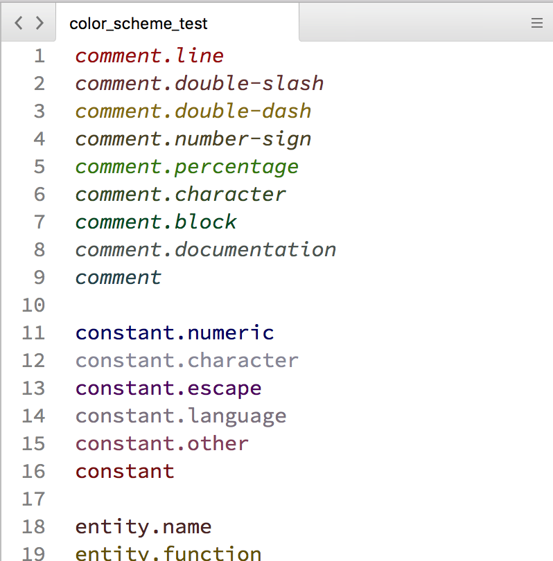

# ColorSchemeTest
Package for testing Sublime Text Color Schemes comprehensively

Contains 4 files:

 - `color_scheme_test`: a text file containing a list of every scope mentioned [here](http://manual.macromates.com/en/language_grammars#language_rules)
 
 - `color_scheme_test.sublime-syntax`: a syntax file matching the text `example.scope` to the scope `example.scope`
 
 - `ColorSchemeTest.tmTheme`: An example color scheme with an entry for each scope
 
 - `ColorSchemeTest.YAML`: YAML file used to generate `ColorSchemeTest.tmTheme`
 
 
To test a color scheme, open the file `color_scheme_test` and make sure its syntax is identified as "Color Scheme Test". With the color scheme you want to test applied, this will show the formatting applied to each scope.

